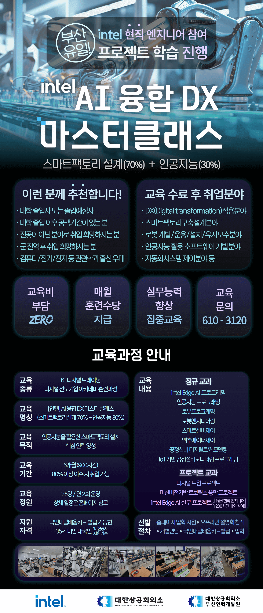

  <!-- 1. 미니게임 세션 -->
  <h2>🎮 Mini Game Zone</h2>

  

  

    
    
  

   

  <!-- 2. 교육 과정 정보 (courseImage.png 연결 완료) -->
  <h2>🎓 Current Education & Training</h2>
  
  <table align="center">
    <tr>
      <td align="center" width="120"><b>기관명</b></td>
      <td><b>대한상공회의소 부산인력개발원 x Intel</b></td>
    </tr>
    <tr>
      <td align="center"><b>과정명</b></td>
      <td><b>[인텔] AI 융합 DX 마스터클래스</b> 스마트팩토리 설계(70%) + 인공지능(30%)</td>
    </tr>
    <tr>
      <td align="center"><b>주요 내용</b></td>
      <td>
        • <b>Intel Edge AI</b> & 인공지능 프로그래밍 
        • <b>로봇 프로그래밍</b> / 로봇 엔지니어링 / 액추에이터 제어 
        • 스마트설비 제어 & IoT 기반 공장설비 모니터링 
        • <b>공장설비 디지털 트윈 모델링</b> & 머신비전 기반 로보틱스 융합 프로젝트
      </td>
    </tr>
    <tr>
      <td align="center"><b>과정 포스터</b></td>
      <td>
        <!-- 💡 버튼 클릭 시 같은 폴더의 courseImage.png 가 새 탭에서 열립니다 -->
        
      </td>
    </tr>
  </table>

  <!-- 💡 프로필 내에서도 클릭해서 펼쳐볼 수 있는 포스터 접이식 메뉴 -->
  

    
<b>🔍 프로필 안에서 포스터 크게 보기 (클릭)</b>

     
    
  

    

  <!-- 3. 핵심 기술 스택 배지 -->
  <h3>🛠️ Tech Stack & Tools</h3>
  
  

    
    
    
     
    
    
    
     
    
    
    
  

   

  <!-- 4. GitHub Welcome Card -->
  <h3>📊 GitHub Welcome Card</h3>

  

    

  <!-- 5. 방문자 수 카운터 -->
  

